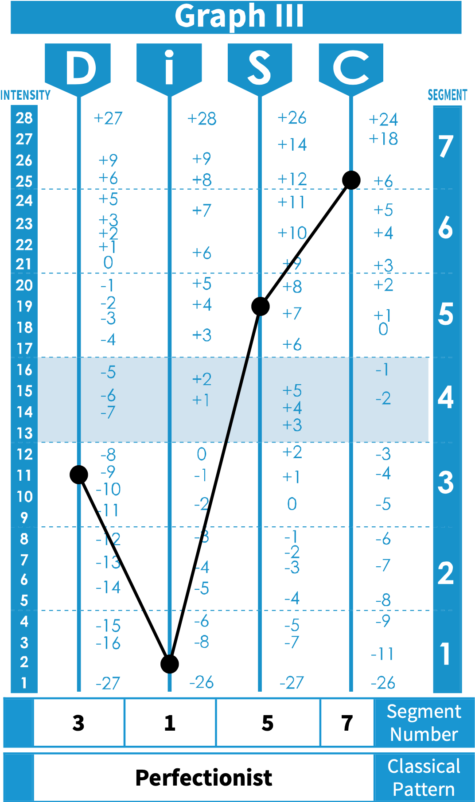

<!--author-->

I prefer Kai, but Kyle is acceptable. I like code, sound, and minimalism. I:

- Worked 4 years in Operations for a Fortune 250 telecommunications enterprise that launched [Sling.tv](https://sling.tv).
- Joined multiple early series startups, including Commerce, which [celebrated an IPO as BIGC in August 2020](https://www.bigcommerce.com/press/releases/bigcommerce-announces-pricing-of-initial-public-offering/).
- [Contributed to FOSS and OSS projects forever](https://github.com/obrien-k).

My career-path began in 2006, cutting my teeth in forums and communities before graduating to production software.
I spent 2017–2020 at BigCommerce discovering the soul of a great engineering team.
From 2022-2024, I worked for Apollo, establishing best practices for developer support documentation and community outreach.

I'm also available for SWE, Technical Writing, and design contract work.

---

**Factoids:**
- Dark Side of the Moon is better as a single uninterrupted track — stitch it in Audacity if you haven't
- 3.141592653589793238462643383279502884197969399375105
- Ares, the Roman god of war, is the [etymology of Mars](https://books.google.com/books?id=8QiwAqGlmAQC)
- [BigCommerce thought leader](assets/about-me/bigcommerce-thought-leader.png)
- [google](https://www.google.com/search?q=code+study+group) [code study group](assets/about-me/code-study-group.png)
- //TODO

---

*[Perfectionists have a strong inner drive to be systematic and precise in everything they do, prioritizing accuracy, structure, and following established procedures.](https://www.123test.com/disc-profile-perfectionist/)*
{:.figcaption}

<!--posts-->
